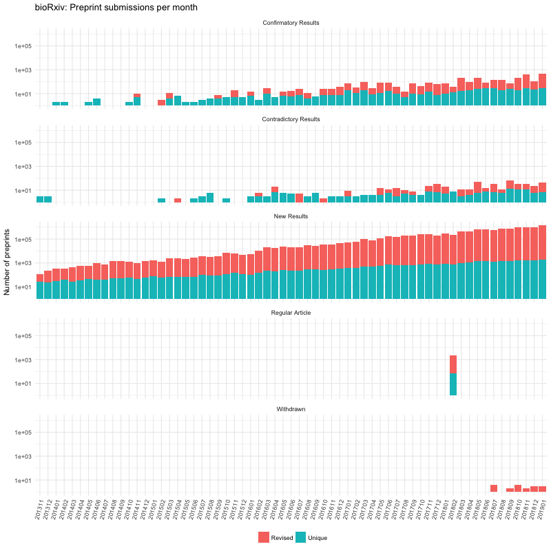
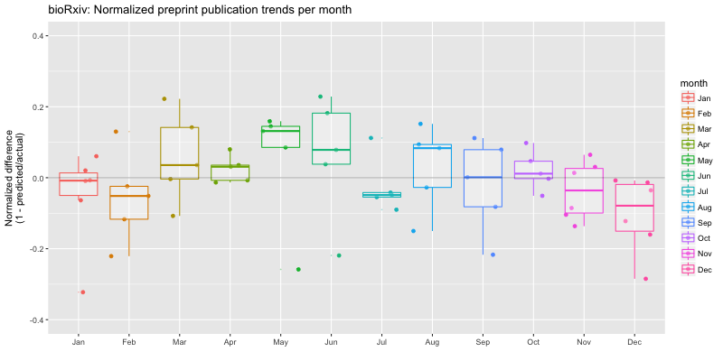
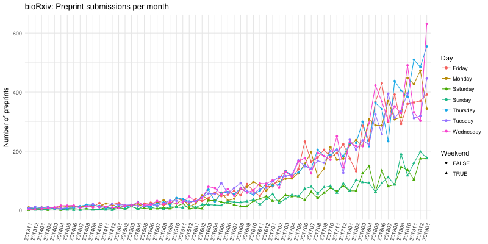
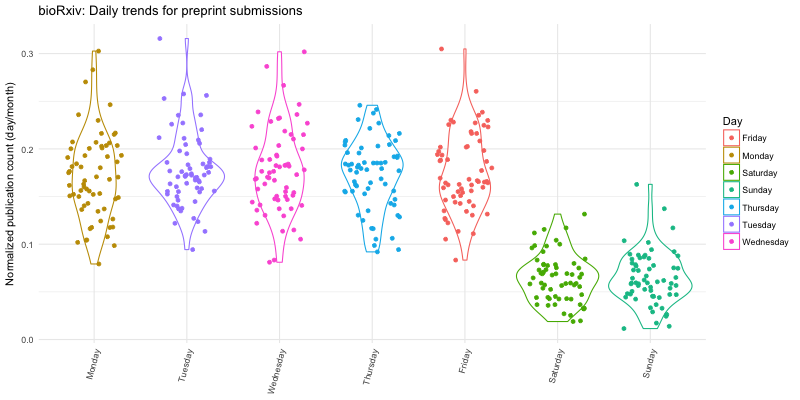

# bioRxiv list
List of preprints deposited to bioRxiv with some metadata to them.

## Scripts
- [Scrape preprints and save as a data frame.ipynb](Scrape%20preprints%20and%20save%20as%20a%20ata%20frame.ipynb): For scraping details from biorXiv
- [Generate summary plots.ipynb](Generate%20summary%20plots.ipynb): To generate summary plots using the scraped data

## Plots

