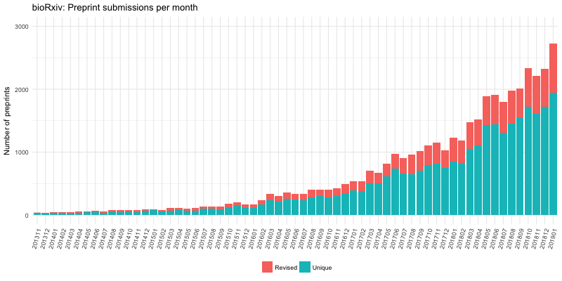

# bioRxiv list
List of preprints deposited to bioRxiv with some metadata to them.

## Scripts
- [Scrape preprints and save as a data frame.ipynb](Scrape preprints and save as a data frame.ipynb): For scraping details from biorXiv
- [Generate summary plots.ipynb](Generate summary plots.ipynb): To generate summary plots using the scraped data

## Plots

